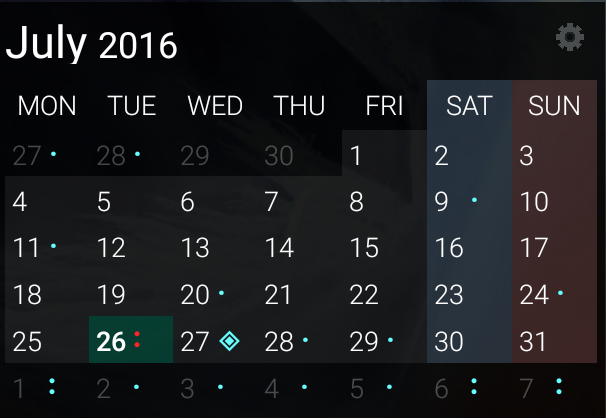

## Minimal Calendar Widget

    
    

#### Features

* 3x2 (resizable)
* Simple dark theme
* Displays all events from your calendars as dots or symbol (high number becomes generic)
* Pressing on header opens widget configuration (start weekday, symbol set)
* Pressing on widget day cells opens calendar application
* Updates automatically every 30 mins (also triggered when pressed)
* minSDK → 19 (android 4.4)

  

    

  

#### Licensing

MinCal Widget is licensed under the [BSD 3-clause](https://github.com/mvmike/min-cal-widget/blob/master/LICENSE).
In addition to the terms set by the License, we ask that if you use any code from this repository that you send us a message to let us know.