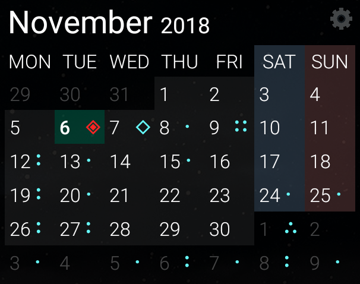
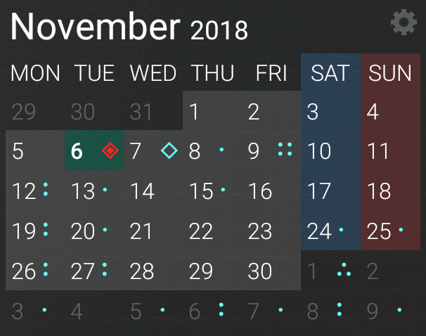
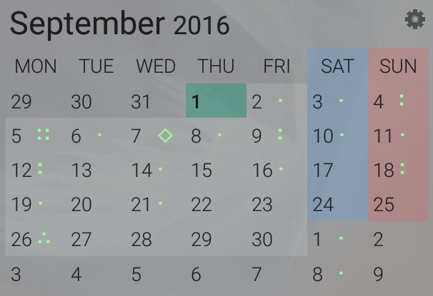
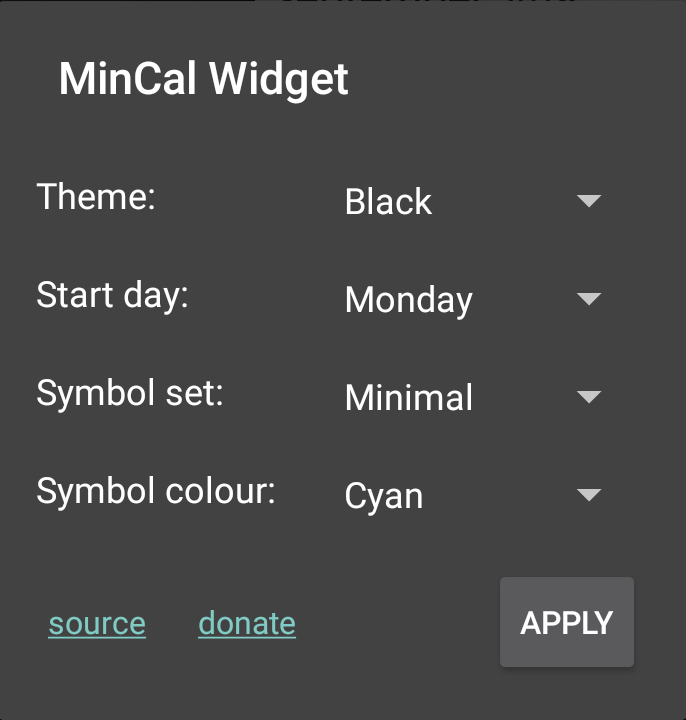

    

## Minimal Calendar Widget

    
    
    

    

#### Features

* 3x2 (resizable)
* Displays all events from your calendars with a symbol set (high number becomes generic)
* Pressing on header opens widget configuration
* Pressing on widget day cells opens calendar application
* minSDK: 26 (android 8.0), to use `java.time.*` package instead of Date/Calendar APIs

#### Supported languages

* English
* Catalan
* Spanish
* French
* Norwegian
* Dutch
* Russian

#### Licensing

MinCal Widget is licensed under the [BSD 3-clause](LICENSE).

#### Changelog

| Version        | Date           | Changes                                                                                                                                                             |
| :------------: |:-------------: | :------------------------------------------------------------------------------------------------------------------------------------------------------------------ |
| v1.4.1         | 2020-06-05     | - internationalization (German and Croatian) - technical improvements                                                                                            |
| v1.4.0         | 2019-08-25     | - support for android 10 - technical improvements                                                                                                                |
| v1.3.0         | 2019-04-15     | - use adaptive icon set - improve cells text alignment                                                                                                           |
| v1.2.3         | 2019-04-08     | - internationalization (French and Norwegian)                                                                                                                       |
| v1.2.2         | 2019-03-18     | - bug fixes - technical improvements                                                                                                                             |
| v1.2.1         | 2019-02-26     | - internationalization (Dutch and Russian) - technical improvements                                                                                              |
| v1.2.1         | 2019-02-26     | - internationalization (Dutch and Russian) - technical improvements                                                                                              |
| v1.2.0         | 2019-02-25     | - internationalization support                                                                                                                                      |
| v1.1.0         | 2018-12-20     | - technical improvements                                                                                                                                            |
| v1.0.1         | 2018-11-26     | - fix event instance calculation zoneId                                                                                                                             |
| v1.0.0         | 2018-11-14     | - minSDK upgraded to 26 (android 8.0) - technical improvements                                                                                                   |
| v0.4.0         | 2018-11-06     | - add config options - technical improvements                                                                                                                    |
| v0.3.3         | 2018-08-31     | - support for android Pie - technical improvements                                                                                                               |
| v0.3.2         | 2018-01-07     | - bug fixes - technical improvements                                                                                                                             |
| v0.3.1         | 2017-10-16     | - bug fixes - technical improvements                                                                                                                             |
| v0.3.0         | 2017-01-06     | - manage calendar read permission at widget creation                                                                                                                |
| v0.2.2         | 2017-01-03     | - bug fixes - technical improvements                                                                                                                             |
| v0.2.1         | 2016-10-06     | - bug fixes - technical improvements                                                                                                                             |
| v0.2.0         | 2016-09-01     | - support themes - redraw widget on date change - redraw widget on calendar event instance change                                                             |
| v0.1.1         | 2016-08-27     | - permissions asked at first widget creation                                                                                                                        |
| v0.1.0         | 2016-08-26     | - raised icon contrast - permissions are asked at first calendar press - source and donation link in settings - events colour configuration - bug fixes |
| v0.0.1         | 2016-08-04     | - initial release                                                                                                                                                   |